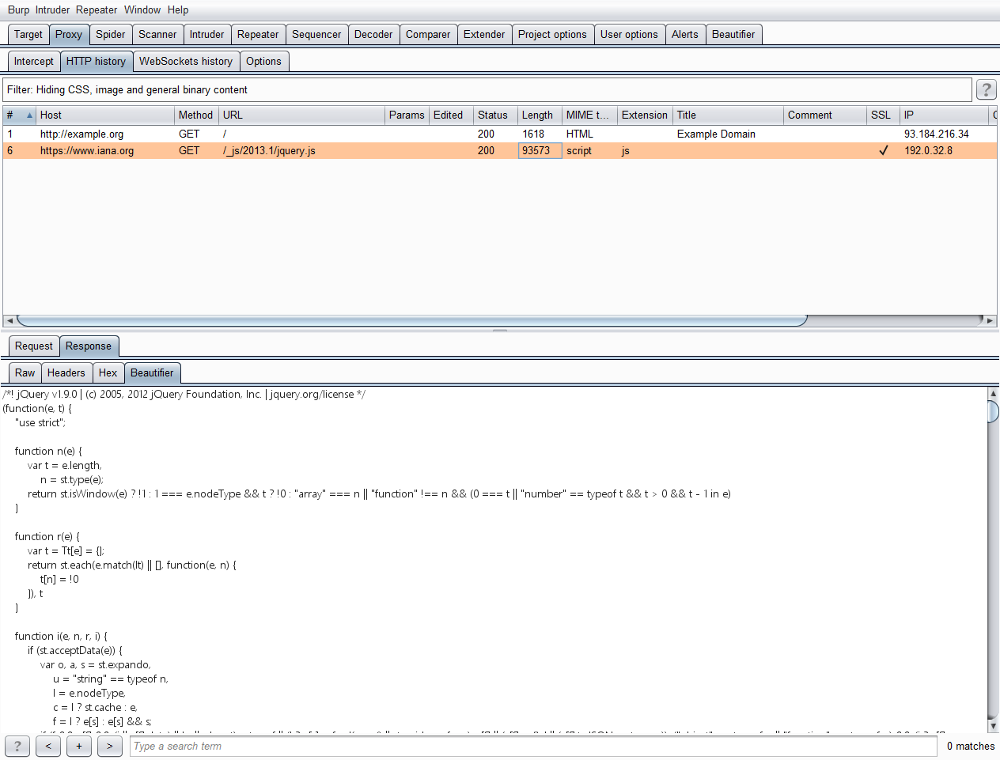
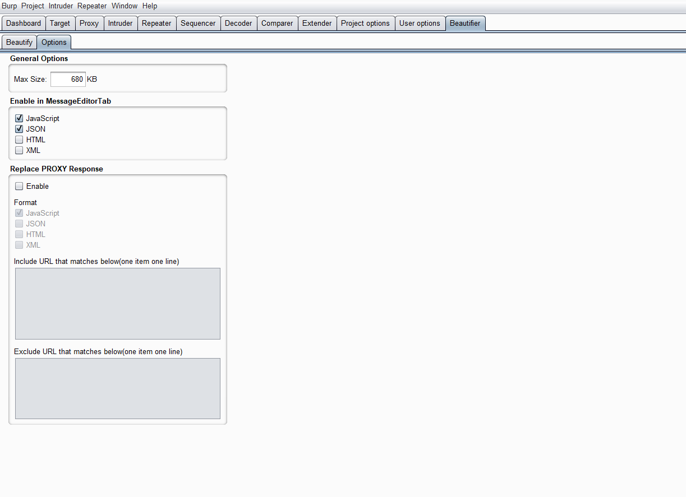

BurpBeautifier is a Burpsuite extension for beautifying request/response body, supporting JS, JSON, HTML, XML format, writing in Jython 2.7.

### Installation
(Assume you already have Burpsuite and Java Environment)
1. Visit [Jython Offical Site](https://www.jython.org/download), and download Jython Installer.
2. Open Jython Installer to install Jython(In standard mode, make sure it will install pip). Assume it has be installed in `D:\jython2.7.1` directory.
3. Install Jython modules: `D:\jython2.7.1\bin\jython.exe -m pip install -r requirements.txt`.(If your pip is not installed successfully, check this [article](https://www.jianshu.com/p/527aa4385ea1) I written in Chinese)
4. Open Burpsuite, goto Extender -> Options -> Python Environment, set the Location of Jython Jar is `D:\jython2.7.1\jython.jar`, and the Folder for loading modules is `D:\jython2.7.1`.
5. Download this tool, Open Burpsuite, goto Extender -> Extensions -> Add -> Choose the beautifier.py.

### Screenshot
MessageEditorTab:

Standalone beautifier panel:

Options:

### Options
1. `Enable in MessageEditorTab`: By default, JavaScript and JSON is enable, and HTML and XML is disable cause Burpsuite already beautify these.
2. `Replace PROXY Response`: Enable it if you want to beautify response and replace it.

### Features
1. Supportting Format
   - JS: use jsbeautify module
   - JSON: use jsbeautify module
   - HTML: use beautifulsoup4 module, and jsbeautify module for js code in HTML
   - XML: use xml module
2. Writing in Jython, modify source code conveniently. eg: Modify the beautify function to change how to beautify.
3. Beautify and replace response body.

### Notice
1. It may modify data, such as: beautifying xml will add the `<?xml version="1.0" encoding="UTF-8"?>` header, beautifying html will repair html tag.
2. Assuming the request/response body is utf-8, so if the body is not utf8 encoding or compatible with utf8, it may not work well.
3. Not considering gzip/deflate compress/decompress, so need the Proxy->Options->Miscellaneous->Unpack gzip/deflate in response is enabled (ON by default)

### Limitations
1. Installation is not convenient. Not like Java extension, just add a jar file.
2. Jython is slow. So It will not beautify if size excess dataMaxSize(default is 680KB)